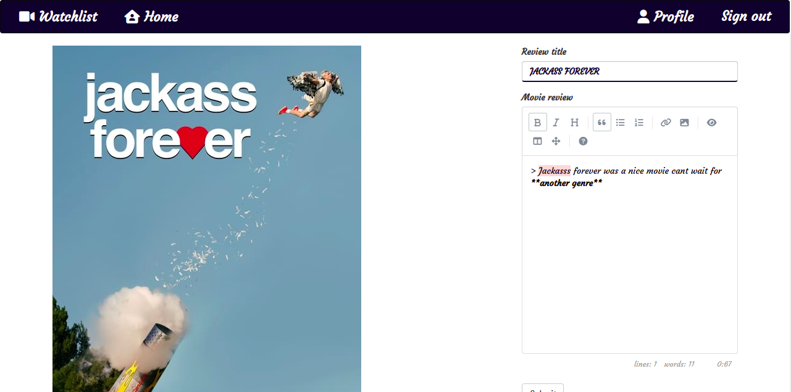

# Movie-Watchlist 

### By Reuben Kipkemboi

## Table of Content

+ [Description](#description)
+ [Installation Requirement](#installation-requirements)
+ [Technology Used](#technologies-used)
+ [License](#license)
+ [Authors Info](#authors-info)

## Description


[Go Back to the top](#movie-watchlist)


## User Stories

A movie review website using <mark>flask</mark>. The web application will allow a <mark>user to find a movie, add a review to the movie and also add comments to reviews.</mark>

This Application is composed of the following modules;

##### Home page


##### Login page


##### Register module


##### Movie description section


##### User profile


##### Movie-Review module


##### Search Results


##### Review description section




[Go Back to the top](#movie-watchlist)


## Installation Requirements

### Prerequisites

- pip
- gunicorn
- flask
- wtf-forms

## Instructions

1) Git clone the repository to your local computer
```
https://github.com/Reuben-Kipkemboi/Movie-Watchlist.git
```
2. change Directory `cd` into News-Api

```
cd News-Api
```
3. create a virtual environment

```
python3.8 -m venv virtual
```
4. activate the virtual environment 
```
source virtual/bin/activate

```
5. To deactivate the environment

```
deactivate
```

6. Install Flask

```
pip install flask || pip3 install flask
```
7. Execute start.sh

```python

chmod a+x start.sh

./start.sh

```

[Go Back to the top](#movie-watchlist)


## Technologies Used

- Python3.8
- Flask
- HTML
- Bootstrap

## License
[MIT License](LICENSE)

## Live Site
* #### https://mymovie-watchlist.herokuapp.com/

## Authors Info
* Slack - [Reuben Kipkemboi]()

* Email - [Reuben Kipkemboi](https://gmail.com) :email: 


<p align = "center">
    &copy; 2022 @ Reuben Kipkemboi.
</p>